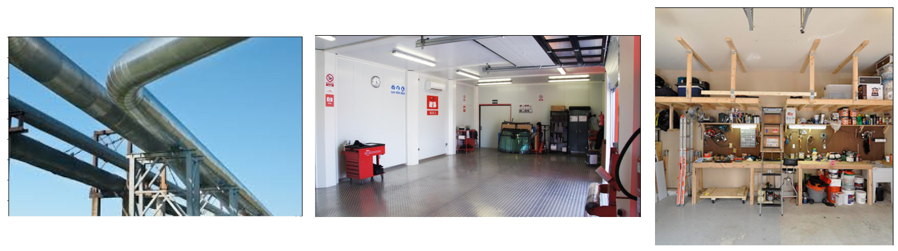
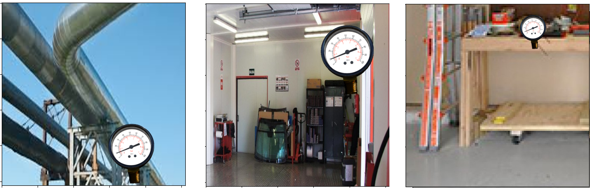
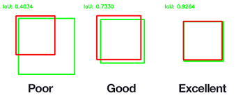
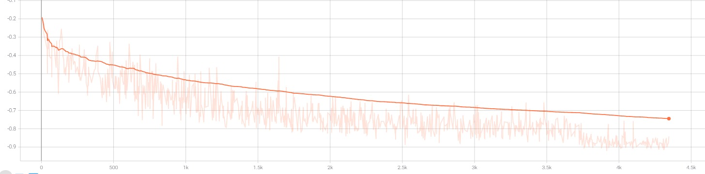

# Gauge Reading

## How to work with it?

For this project I have used PyTorch 1.8.0 and some other libraries that are listed in the `requirements.txt` file.
If you need to work with the project, create a virtual environment and install the listed requirements to ensure the reproducibility with the same versions.

All the Python source codes can be found inside the `src` folder. You can find the two main scripts in the root folder.
With `train.py` you can train a model by specifying the configuration in the program arguments, such as the number of epochs, batch size, dataset folder, random seed or previous checkpoint to resume training or do fine-tuning.

As an example, we can train a model with the following command, that will train it over the datasets folder data for 50 epochs with a batch size of 8 and a fixed random seed of 42.

```bash
$ python src/train.py datasets --epochs 50 --bs 8 --seed 42  
```

The other script, `test.py` allows to evaluate the model for a given checkpoint, showing the images of the given dataset with the associated prediction.
The command to execute it, is similar to the train one:

```bash
$ python src/test.py datasets/validation --checkpoint_path checkpoints/1/9.pt --bs 8
```

Please, refer to the `--help` flag to obtain further usage information for both scripts.

## Code Structure

The core code is separated into different packages according to the given functionalities.
Even that some packages may be unnecessary for this small project (e.g. models),
I structured it in a way that it would be easy to keep it organized as the project keeps growing.

#### Managers
In this package we have the main classes that manage the model training process, dataset generation and criteria functions to use as  loss functions.

#### Models
The idea of this package is to contain all the possible custom models to train them for our task, or (as it is now), to add some helpers to create and tune some models from the torchvision zoo.

#### Transforms
In transforms, I have created all the custom transformations for data augmentation techniques, as well as some common utility functions that are used on those.

#### Misc
Some general scripts used for data exploration, downloading backgrounds from online images and util functions for displaying images.

## Thinking process
Part of the thinking process belongs to the Code Structure section, as defining the program flow and components already requires from a thinking process.
However, in this section I want to go into details about the thinking process that involves the decisions about the loss function, network architecture, data augmentations...

### Dataset
A first analysis of the given data shows us two clear things. The dataset is not large enough and the training data samples are synthetic images (or manually modified) as those do not have a background and there is only the gauge itself in the foreground.
Therefore, the models trained with the training data will not be able to generalize well for real photos.

Hence, we must apply some data augmentation tricks to add variety to the training images. I opt to work with on-the-fly data augmentation, the common approach that torch and torchvision provide,
as it potentially creates a larger number of variations without having to modify the original dataset only at the cost of having to compute every new sample during the training process.

#### Data Augmentations
There are some common already implemented data augmentation techniques from `torchvision` that I should have used, such as `RandomResizedCrop`, `RandomPerspective`, `RandomHorizontalFlip`, with some
slight modifications such as transforming the bounding box along with the image transformation. Another idea was to build somehow a simulator environment to generate a higher number of gauge samples
with a higher diversity of situations such as different angles, illumination, background... but it is a difficult thing to setup in only one week.

Instead of that, I have decided to focus in the implementation of some (somehow) simple but effective new transformations.
The three transformations listed below, assume that the image have an alpha channel that allows to separate the gauge in the foreground from the background. 

##### Resize
As the name states, this step resizes the gauge sub-image by a given `resize_factor`, as well as recalculating the bounding box of the gauge. This step is not properly a data augmentation technique, but a pre-processing step.
The idea behind it is to reduce the dimensionality of the input data, not mainly to try to overcome a typical curse of dimensionality problem, but to improve the performance of the training process, allowing to use a much larger batch size.
I have used this step because my hardware resources were so limited and with the original size of the images and a small model such as ResNet18, I was barely able to pass two elements on the same batch, resulting sometimes in a CUDA out of memory problem.  

##### Random Gauge Offset
This step consists in randomly cropping the gauge sub-image uniformly between a `min_cropping_factor` and a `max_cropping_factor`. 
The cropped result, is then shifted randomly inside the image. The associated bounding box is also recalculated along with the image transformations.

##### Random Background
Finally, we want to overcome the problem of having gauge images with a transparent background. To do so I have the external script `misc/background_downloader.py`, that crawls google images while downloading a given number of those images that match some keywords.
I have thought about possible places where we can find a gauge, so I have extracted images from workshops, car control panels, pipeline systems...

Here we have some of the example retrieved images:

 

This step randomly samples one of these downloaded images and applies some random cropping to it between `min_cropping_factor` and `1`,
to increase the diversity of the resulting data even if we use the same image as the background.

Then, we differentiate the foreground and the background form the gauge image using the alpha channel, substituting transparent background
with the sampled image. The previous example images applied to some gauges from the data look like the following (also applying the `Random Gauge Offset` step):

 

### Model Architectures
As for the model architectures I have considered testing different typically used architectures,
such as models from the R-CNN family, YOLO, SSD, RefineNet... These models require a decent GPU to train them and I did not dispose of the necessary time and hardware resources to experiment with all of them,
or build a cloud pipeline system to experiment with online clusters such as Google Cloud Compute.

Another important decision to make is about whether to tackle the problem as a single prediction problem or to decompose it 
between bounding box prediction and then a regression to read the gauge value from the region inside the predicted bounding box.
I have decided to use it two-task sequential prediction, a decision that goes hand ind hand with the models that I have experimented with,
a small ResNet18 for each sub-task, which allows me to run the training with a decent batch size and training time.
With more resources it would be nice to experiment with this decision if we use detection specific architectures.

I have also assumed that each image contains a single gauge, so it is not necessary to use techniques that solve the multiple object detection problem,
so I can use a "vanilla"-CNN approach instead.

I have also considered using some classical Computer Vision techniques for the regression problem using OpenCV,
with circle detection to extract the gauge sphere and angles, line detection to look for the needle and contour detection to find the lines that go from the minimum to the maximum value.
By computing the angle between the needle and the circle with respect to the axis points, it is possible to extract the normalized value in range [0, 1] of the gauge.
However, I have assumed that the goal of this exercise is to show my PyTorch skills, so I have decided to stick with a DL model. 
 
#### Loss Functions
The loss function for the regression problem to predict the normalized gauge value is the traditional one for regression problems, the Mean Square Error loss, which decreases the closer we get to the target value.

For the bounding box prediction task we have to build a more sophisticated method. Considering that the network outputs four values `(min_x, min_y, width, height)`, the simpler idea is to go also with a MSE loss function. However, this do not represent well the idea of what we want to obtain.

Therefore, I have designed a custom loss function, which computes the Intersection over Union ratio between two bounding boxes. This loss function is in range `[0, 1]`, where two boxes that do not intersect at all have an score of zero, while a perfect matching has an score of one.
As PyTorch minimizes the loss function during the optimization and, in this case, we want to increase the value of the IoU, we simply return the negative value of it, and our goal is to obtain a score of -1.
The following image illustrates the idea implemented in `managers/criteria.py`.

 

In the following image we can see the the IoU during the training process (which is approaching to -1), that I have monitored using Tensorboard. 


### TODO:
There are a bunch of ideas that I had in mind to to but I wasn't unable to due to the reduced amount of time that I had available to work with this exercise. I quickly list them below:
- Experiment with different model architectures and sub-tasks
    - Evaluate performance in terms of trade-off between precision and time
        - E.g. Faster-RNN may have a greater performance while MobileNet is more suitable for real-time applications.
    - Train independently the bounding box prediction task and value prediction or do it all together as a combined loss.
    - Alternative backbone models, not only the smaller resnet.
- Further data augmentation techniques with simulation environments.